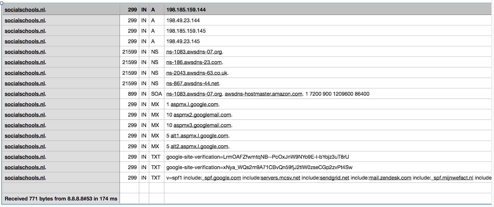

# dns-tookit
Tools to automate finding DNS records for websites

```sh
mkvirtualenv dns -p $(which python3)
setvirtualenvproject
add2virtualenv .
# How to Run
python src/main.py --domain=socialschools.nl # run the script, outputs the csv file for the domain
```

It will generate a CSV file the home directory called as `socialschools.nl.csv` which will look like the screenshot below



